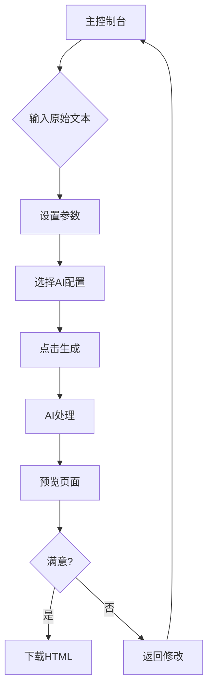

## 1. 产品概述
ESL Worksheet Generator是一个专为英语教师设计的在线工具平台，能够将原始英语材料（新闻、文章等）自动转换为符合欧洲语言共同参考框架（CEFR）标准的A1/A2级别HTML格式练习题。教师可以通过简单的设置生成可直接使用的教学材料，并支持部署到GitHub Pages。

该平台解决了教师手动制作分级英语练习的痛点，提高教学材料制作效率，确保内容难度与学生水平匹配。

## 2. 核心功能

### 2.1 用户角色
| 角色 | 注册方式 | 核心权限 |
|------|----------|----------|
| 教师用户 | 无需注册，本地使用 | 上传文本、设置参数、生成练习、下载HTML文件 |

### 2.2 功能模块
平台包含以下主要页面：
1. **主控制台**：文本输入、参数设置、AI配置、生成控制。
2. **预览页面**：生成的HTML练习预览和下载。
3. **设置页面**：AI平台API配置和管理。

### 2.3 页面详情
| 页面名称 | 模块名称 | 功能描述 |
|-----------|-------------|-------------|
| 主控制台 | 文本输入区 | 粘贴或输入原始英语材料，支持多段落文本 |
| 主控制台 | 学生年级选择 | 选择小学、初中、高中等等级 |
| 主控制台 | CEFR难度设置 | 选择A1、A2、B1、B2、C1、C2级别 |
| 主控制台 | 语法难度设定 | 设置语法复杂度（基础、中级、高级） |
| 主控制台 | 图片上传 | 上传与文本相关的图片，支持拖拽上传 |
| 主控制台 | 练习类型选择 | 选择生成练习类型（词汇、阅读理解、语法等） |
| 主控制台 | 生成按钮 | 一键生成HTML格式练习 |
| 预览页面 | HTML预览 | 显示生成的练习页面预览 |
| 预览页面 | 下载功能 | 下载HTML文件到本地 |
| 预览页面 | 重新编辑 | 返回主控制台修改参数 |
| 设置页面 | AI平台选择 | 选择OpenAI、Anthropic、Gemini、DeepSeek、Moonshot AI、Alibaba Qwen、ZhipuGLM等平台 |
| 设置页面 | API密钥配置 | 输入和管理API密钥 |
| 设置页面 | 模型选择 | 选择具体的AI模型 |
| 设置页面 | 自定义端点 | 支持自定义API端点配置，支持OpenAI兼容的任何提供商 |
| 设置页面 | 中国模型配置 | 专门配置中国大模型API参数和端点 |

## 3. 核心流程
教师用户使用流程：
1. 访问主控制台页面
2. 在文本输入区粘贴英语材料
3. 设置学生年级、CEFR级别、语法难度
4. 上传相关图片（可选）
5. 选择练习类型
6. 点击生成按钮
7. 在预览页面查看生成的练习
8. 下载HTML文件或返回修改

## 4. 用户界面设计

### 4.1 设计风格
- **主色调**：教育蓝（#2563eb）配白色背景
- **辅助色**：浅灰色（#f3f4f6）用于卡片背景
- **按钮样式**：圆角矩形，主要操作为蓝色，次要操作为灰色
- **字体**：系统默认字体，标题18px，正文14px
- **布局风格**：卡片式布局，左侧设置面板，右侧预览区域
- **图标风格**：使用简洁的教育主题图标

### 4.2 页面设计概览
| 页面名称 | 模块名称 | UI元素 |
|-----------|-------------|-------------|
| 主控制台 | 文本输入区 | 大尺寸文本框，带语法高亮，支持拖拽文件 |
| 主控制台 | 参数设置面板 | 下拉选择框，滑块控制，标签清晰分组 |
| 主控制台 | 图片上传区 | 拖拽区域，显示缩略图预览 |
| 主控制台 | 生成控制区 | 醒目的蓝色生成按钮，进度指示器 |
| 预览页面 | 练习预览 | 模拟真实练习页面，包含题目和答题区 |
| 预览页面 | 操作按钮 | 下载按钮（绿色）、返回按钮（灰色） |
| 设置页面 | API配置表单 | 输入框、下拉选择、测试连接按钮 |

### 4.3 响应式设计
- **桌面优先**：主要针对教师使用的桌面环境优化
- **平板适配**：支持iPad等平板设备的基本操作
- **移动端**：仅提供基础预览功能，不建议在小屏幕上编辑

### 4.4 部署指导
- 支持静态网站托管，可直接部署到GitHub Pages
- 所有AI交互通过客户端JavaScript完成，无需后端服务
- 配置文件支持环境变量设置，便于不同部署环境