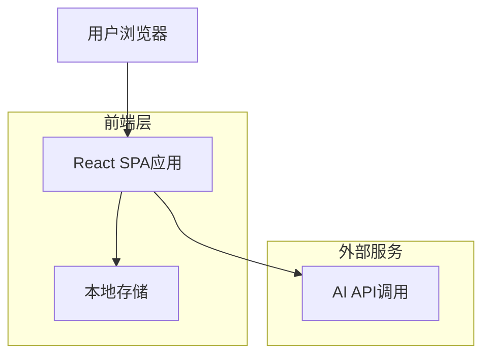
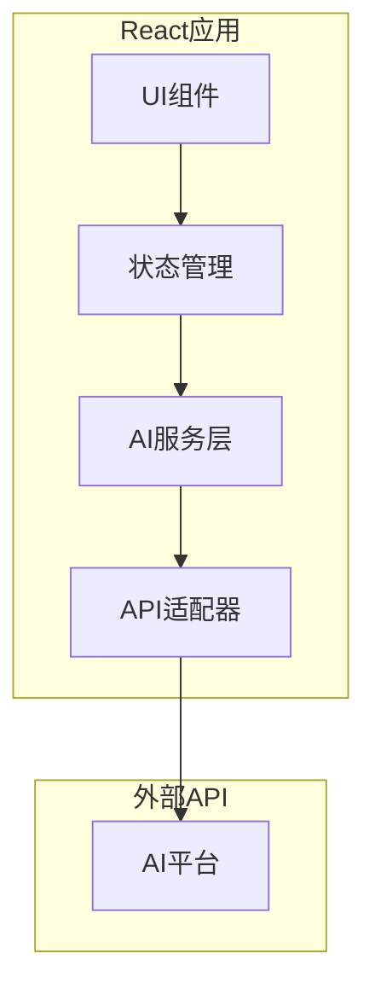

## 1. 架构设计



## 2. 技术描述

- **前端**: React@18 + TailwindCSS@3 + Vite
- **初始化工具**: vite-init
- **状态管理**: Zustand
- **AI集成**: 支持OpenAI、Anthropic、Gemini、DeepSeek、Moonshot AI、Alibaba Qwen、ZhipuGLM API，支持自定义OpenAI兼容端点
- **部署**: GitHub Pages静态托管
- **无后端**: 纯客户端应用，所有逻辑在前端完成

## 3. 路由定义

| 路由 | 用途 |
|-------|---------|
| / | 主控制台页面，文本输入和参数设置 |
| /preview | 预览生成的HTML练习 |
| /settings | AI平台API配置页面 |
| /about | 关于页面，使用说明 |

## 4. API定义

### 4.1 AI平台集成

**OpenAI API调用**
```javascript
POST https://api.openai.com/v1/chat/completions
Headers: {
  "Authorization": "Bearer {api_key}",
  "Content-Type": "application/json"
}
```

请求参数：
| 参数名 | 参数类型 | 是否必需 | 描述 |
|-----------|-------------|-------------|-------------|
| model | string | true | 模型名称（gpt-3.5-turbo, gpt-4等） |
| messages | array | true | 对话消息数组 |
| temperature | number | false | 创造力参数（0-1） |
| max_tokens | number | false | 最大输出长度 |

**Anthropic API调用**
```javascript
POST https://api.anthropic.com/v1/messages
Headers: {
  "x-api-key": "{api_key}",
  "Content-Type": "application/json"
}
```

**Gemini API调用**
```javascript
POST https://generativelanguage.googleapis.com/v1beta/models/{model}:generateContent?key={api_key}
```

**DeepSeek API调用**
```javascript
POST https://api.deepseek.com/v1/chat/completions
Headers: {
  "Authorization": "Bearer {api_key}",
  "Content-Type": "application/json"
}
```

**Moonshot AI API调用**
```javascript
POST https://api.moonshot.cn/v1/chat/completions
Headers: {
  "Authorization": "Bearer {api_key}",
  "Content-Type": "application/json"
}
```

**Alibaba Qwen API调用**
```javascript
POST https://dashscope.aliyuncs.com/api/v1/services/aigc/text-generation/generation
Headers: {
  "Authorization": "Bearer {api_key}",
  "Content-Type": "application/json"
}
```

**ZhipuGLM API调用**
```javascript
POST https://open.bigmodel.cn/api/paas/v4/chat/completions
Headers: {
  "Authorization": "Bearer {api_key}",
  "Content-Type": "application/json"
}
```

**自定义OpenAI兼容端点**
```javascript
POST {custom_endpoint}/v1/chat/completions
Headers: {
  "Authorization": "Bearer {api_key}",
  "Content-Type": "application/json"
}
```

### 4.2 请求数据结构

**生成练习请求**
```typescript
interface GenerateWorksheetRequest {
  originalText: string;
  studentGrade: string; // "elementary" | "middle" | "high"
  cefrLevel: string; // "A1" | "A2" | "B1" | "B2" | "C1" | "C2"
  grammarDifficulty: string; // "basic" | "intermediate" | "advanced"
  exerciseTypes: string[]; // ["vocabulary", "reading", "grammar"]
  imageUrl?: string;
  aiProvider: string; // "openai" | "anthropic" | "gemini" | "deepseek" | "moonshot" | "qwen" | "zhipu" | "custom"
  apiKey: string;
  model: string;
}
```

**生成练习响应**
```typescript
interface GenerateWorksheetResponse {
  success: boolean;
  htmlContent?: string;
  error?: string;
  metadata?: {
    wordCount: number;
    exerciseCount: number;
    estimatedTime: number;
  };
}
```

## 5. 客户端架构



## 6. 数据模型

### 6.1 本地存储结构

**用户设置**
```typescript
interface UserSettings {
  aiProvider: string;
  apiKey: string;
  model: string;
  customEndpoint?: string;
  customModelName?: string;
  defaultGrade: string;
  defaultCefrLevel: string;
  defaultGrammarDifficulty: string;
  // 中国模型特定配置
  chinaModelConfig?: {
    region?: string;
    endpoint?: string;
    modelVersion?: string;
  };
}
```

**生成历史**
```typescript
interface GenerationHistory {
  id: string;
  timestamp: number;
  originalText: string;
  settings: GenerateWorksheetRequest;
  htmlContent: string;
  metadata: {
    wordCount: number;
    exerciseCount: number;
    estimatedTime: number;
  };
}
```

### 6.2 本地存储实现

使用localStorage进行数据持久化：
```javascript
// 保存设置
localStorage.setItem('worksheet_settings', JSON.stringify(settings));

// 保存生成历史
const history = JSON.parse(localStorage.getItem('worksheet_history') || '[]');
history.push(newItem);
localStorage.setItem('worksheet_history', JSON.stringify(history));
```

## 7. 部署配置

### 7.1 GitHub Pages配置

**vite.config.js**
```javascript
export default {
  base: '/esl-worksheet-generator/',
  build: {
    outDir: 'dist',
    assetsDir: 'assets'
  }
}
```

**package.json脚本**
```json
{
  "scripts": {
    "build": "vite build",
    "deploy": "npm run build && gh-pages -d dist"
  }
}
```

### 7.2 环境变量

**.env文件**
```
VITE_APP_NAME=ESL Worksheet Generator
VITE_DEFAULT_MODEL=gpt-3.5-turbo
VITE_MAX_TEXT_LENGTH=5000
VITE_SUPPORTED_PROVIDERS=openai,anthropic,gemini,deepseek,moonshot,qwen,zhipu,custom
# 中国模型配置
VITE_DEEPSEEK_DEFAULT_MODEL=deepseek-chat
VITE_MOONSHOT_DEFAULT_MODEL=moonshot-v1-8k
VITE_QWEN_DEFAULT_MODEL=qwen-turbo
VITE_ZHIPU_DEFAULT_MODEL=glm-4
```

## 8. 性能优化

### 8.1 代码分割
- 路由级别的代码分割
- AI服务模块的懒加载
- 大型组件的异步加载

### 8.2 缓存策略
- AI响应结果的本地缓存
- 图片文件的Base64缓存
- 用户设置的持久化存储

### 8.3 错误处理
- API调用失败的重试机制
- 网络断开的离线模式
- 用户输入的验证和清理